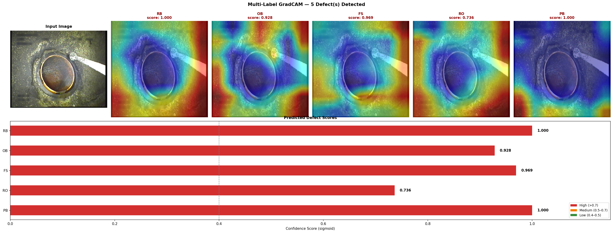
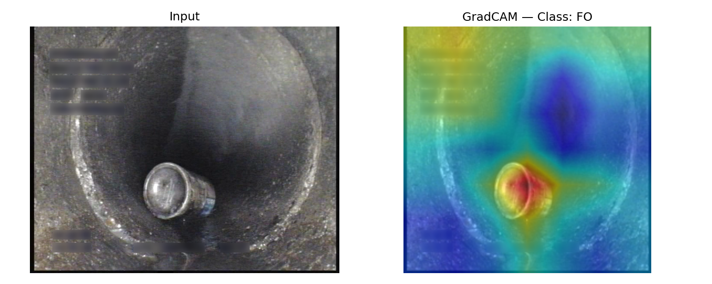
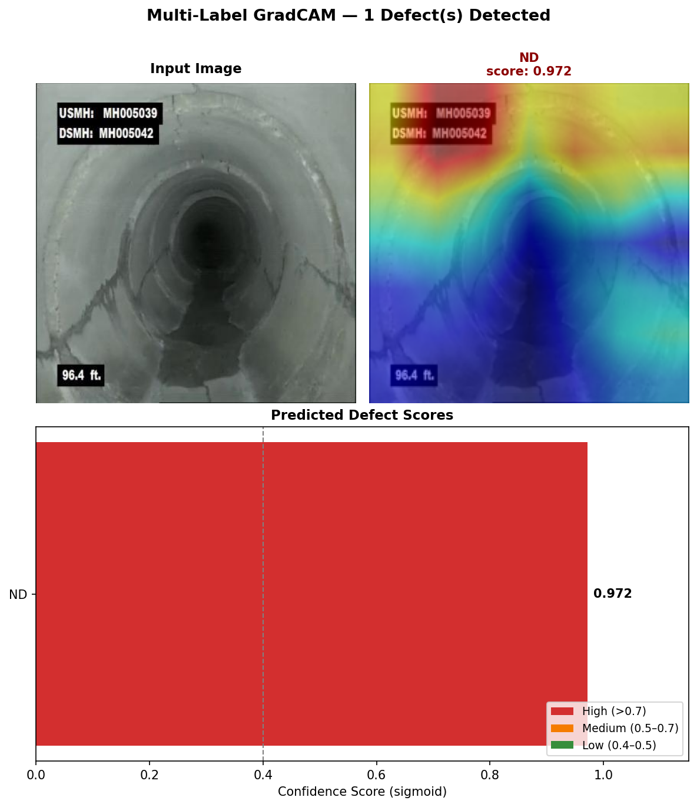

# 🔍 Sewer Defect Detector 
# Author: Sreejith Kannath Kalam - ML Engineer - MSc Robotics and Autonomous Systems

> Multi-label sewer defect classification on the [Sewer-ML dataset](https://github.com/AndersJuul/Sewer-ML)  
> using ConvNeXt-Tiny with class-imbalance-aware training, EMA, and ONNX deployment.

---

## Overview

Automated visual inspection of sewer infrastructure is a safety-critical task involving
highly imbalanced multi-label classification across 19 defect categories. This project
trains a ConvNeXt-Tiny backbone on the Sewer-ML dataset and deploys it as a
containerised FastAPI inference service with ONNX Runtime and INT8 quantisation.

Key contributions:
- **+14.5% micro-F1 improvement** over the default ConvNeXt-Tiny baseline on the hidden test set in the Kaggle competition
- Class-imbalance-aware loss function to handle rare defect categories
- GradCAM interpretability analysis revealing both correct localisation and dataset artifacts
- Full MLOps pipeline: experiment tracking --> ONNX export --> Docker --> CI/CD

---

## Results

| Metric | Baseline (ConvNeXt-Tiny default) | This Work |
|--------|----------------------------------|-----------|
| Micro-F1 (hidden test set) | 0.580 | **0.664** |
| Relative Improvement | — | **+14.5%** |

> Evaluated on the Sewer-ML hidden test set (19-class multi-label).  
> Baseline uses default ConvNeXt-Tiny without imbalance handling or EMA.

### What drove the improvement

| Technique | Role |
|-----------|------|
| Class-imbalance-aware weighted BCE loss | Handles severe label imbalance across 19 classes |
| Exponential Moving Average (EMA, decay=0.999) | Stabilises training, improves generalisation |
| Mixed Precision Training (AMP) | Faster training, lower memory footprint |
| Threshold tuning (0.4) | Optimised decision boundary for multi-label output |

---

## Model Interpretability — GradCAM Analysis

GradCAM visualisations generated using the final depthwise convolutional layer
(`stages[-1].blocks[-1].conv_dw`) of ConvNeXt-Tiny — the last spatially-aware
layer before the classification head.

---

### ✅ Multi-Label Detection: 5 Co-occurring Defects



The model correctly detects all 5 ground-truth defect classes with high confidence
on a severely degraded pipe junction. Activations are spatially overlapping across
classes — expected behaviour given the physical co-localisation of defects in
heavily deteriorated infrastructure.

| Class | Meaning | Confidence |
|-------|---------|------------|
| RB | Root / Brick displacement | 1.000 |
| PB | Pipe Burst / Break | 1.000 |
| FS | Fouling / Sediment | 0.969 |
| OB | Obstruction | 0.928 |
| RO | Root Intrusion | 0.736 |

---

### ✅ Single Defect Localisation: Foreign Object (FO)



For isolated defects the model produces tight, focused activations precisely
localised on the defect region. The foreign object (bolt/cap on pipe floor)
is correctly identified with high spatial precision, while the surrounding
pipe structure is suppressed.

---

### ⚠️ Limitation: Shortcut Learning on ND Class



GradCAM analysis on the ND (No Defect) class revealed that the model attends
primarily to **metadata text overlays** (USMH/DSMH identifiers, depth markers)
rather than the actual pipe appearance. This indicates spurious correlation with
dataset annotation artifacts. Images with overlaid metadata are disproportionately
labelled ND in the Sewer-ML dataset.

**Potential mitigations (future work):**
- Mask or crop text overlay regions during preprocessing
- Augment defect images with synthetic text overlays during training
- Re-evaluate per-class F1 after artifact removal to isolate true ND performance

> This finding was identified through systematic GradCAM analysis and represents
> an honest limitation of the current model. Documenting failure modes is as
> important as reporting aggregate metrics.

---

## Architecture & Training

```
Input (224×224×3)
      │
ConvNeXt-Tiny (ImageNet-1K pretrained)
      │   stem → stage 0 → stage 1 → stage 2 → stage 3
      │
Global Average Pooling
      │
Linear Head (19 classes)
      │
Sigmoid → Multi-label output
```

| Component | Detail |
|-----------|--------|
| Backbone | ConvNeXt-Tiny (pretrained ImageNet-1K) |
| Classifier head | Linear (768 --> 19) |
| Loss function | Class-imbalance-aware weighted BCE |
| Optimiser | AdamW |
| EMA decay | 0.999 |
| Precision | Mixed (AMP) |
| Decision threshold | 0.4 |
| Input resolution | 224 × 224 |
| Normalisation | mean=[0.523, 0.453, 0.345], std=[0.210, 0.199, 0.154] |
| Framework | PyTorch |
| Experiment tracking | Weights & Biases |

---

## Deployment

The model is exported to ONNX with INT8 quantisation for CPU inference
via ONNX Runtime, containerised with Docker, and served via FastAPI.

```
PyTorch model (.pt)
      │
   ONNX export
      │
INT8 quantisation (ONNX Runtime)
      │
FastAPI inference endpoint
      │
Docker container
```

### Run inference locally

```bash
# Pull and run the container
docker pull your-dockerhub-username/sewer-defect-detector:latest
docker run -p 8000:8000 sewer-defect-detector

# Send an inference request
curl -X POST "http://localhost:8000/predict" \
     -F "file=@your_image.jpg"
```


---

## Repository Structure

```
Sewer-Defects-Detector/
├── sewage_defect_detector/
│   ├── src/
│   │   ├── model/
│   │   │   └── transformer_models.py   # ConvNeXt model definition
│   │   ├── config/
│   │   │   └── config.py               # OmegaConf config loader
│   │   └── utils/
│   │       ├── arg_parser.py           # CLI argument parser
│   │       └── utils.py                 # Imbalance-aware loss functions
│   ├── visualization/
│   │   └── visualize.py                # GradCAM visualisation script
│   └── configs/
│       └── configs.yaml                # Experiment configuration
├── assets/                             # README images
│   ├── gradcam_RB_OB_FS_RO_PB.png
│   ├── gradcam_FO.png
│   └── gradcam_ND.png
├── .github/
│   └── workflows/
│       └── ci.yml                      # Lint, test, Docker build
├── Dockerfile
├── requirements.txt
└── README.md
|__ train.py
|__infer.py
|__onnx_inference.py
```

---

## MLOps Pipeline

```
Data (Sewer-ML)
      │
Training (PyTorch + AMP + EMA)
      │
Experiment Tracking (Weights & Biases)
      │
Best checkpoint saved
      │
ONNX export + INT8 quantisation
      │
FastAPI service
      │
Docker containerisation
      │
CI/CD (GitHub Actions) ← lint + test + build on every push
```

---

## GradCAM Visualisation Script for model interpretability

```bash
# Run GradCAM on a custom image
python sewage_defect_detector/visualization/visualize.py \
  --config "sewage_defect_detector/configs/configs.yaml" \
  --checkpoint path/to/model_best.pt
```

The script:
- Auto-detects all classes above the 0.4 confidence threshold
- Generates one GradCAM heatmap per predicted class
- Plots a confidence score bar chart alongside the heatmaps
- Saves the full grid to your specified output directory 

---

## Dataset

[Sewer-ML](https://github.com/AndersJuul/Sewer-ML) — a large-scale multi-label
sewer defect dataset with 19 defect categories and severe class imbalance.
Images are captured from CCTV inspection cameras mounted inside sewer pipes.

| Property | Value |
|----------|-------|
| Classes | 19 (multi-label) |
| Task | Multi-label classification |
| Challenge | Severe class imbalance, visually ambiguous defects |
| Evaluation | Micro-F1 on hidden test set |

---

## Requirements

```bash
pip install -r requirements.txt
```

Key dependencies:

```
torch>=2.0
torchvision
timm
pytorch-grad-cam
onnx
onnxruntime
fastapi
uvicorn
omegaconf
hydra-core
wandb
opencv-python
Pillow
```

---

## Citation

If you use this work, please cite the original Sewer-ML dataset:

```bibtex
@article{sewerml2021,
  title   = {Sewer-ML: A Multi-Label Sewer Defect Classification Dataset and Benchmark},
  author  = {Haurum, Joakim Bruslund and Moeslund, Thomas B.},
  journal = {CVPR},
  year    = {2021}
}
```


